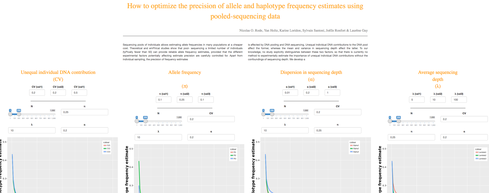

   UNICS
===================


Overview
--------
[**UNICS**](http://www.agap-sunshine.inra.fr/unics/) is a **web app** that helps you computing the standard error of allele frequency estimations of future pool-sequencing experiments based on different parameters (the number of individuals sampled, the frequency of the allele, the coefficient of variation of individual contributions to the DNA pool, the mean and dispersion in sequencing depth).
You can use it trough the [**online version**](http://www.agap-sunshine.inra.fr/unics/) and read the related publication in [**plosOne**](https://academic.oup.com/bioinformatics/article-abstract/33/9/1387/2908431/The-genetic-map-comparator-a-user-friendly?redirectedFrom=fulltext).  
    
Here is a screenshot of the main sheets of the app:



Local use
--------
You can use the tool locally.
You need R to be installed on your computer.
Open R and use the code below:
```
install.packages(shiny)
library(shiny)
runGitHub("Unics","Rode")
```

Local installation
--------
Since local use shows problems for microsoft users, you can install the Genetic Map Comparator on your machine.

**1.** Download the whole repository

**2.** Open R and make sure these library are installed:
```
library(shiny)
library(tidyverse)
library(shinyWidgets)
```

If you miss a library, remember you can install it with:
```
ìnstall.packages("shiny")
```

**3.**
Then, set the working directory and run the App:
```
setwd("my/path/to/the/github/folder/you/downloaded")
runApp()
```


Citing 
--------
If you find this application useful, please cite:  
**How to optimize the precision of allele and haplotype frequency estimates using pooled-sequencing data**    
Nicolas O. Rode, Yan Holtz, Karine Loridon, Sylvain Santoni, Joëlle Ronfort & Laurène Gay  
INRA, UMR AGAP, F-34060 Montpellier, France
Current address: INRA, UMR CBGP (INRA – IRD – Cirad – Montpellier SupAgro), Campus international de Baillarguet, CS 30016, F-34988, Montferrier-sur-Lez, France


About us
--------

Nicolas O. Rode: [homepage](https://sites.google.com/site/nicolasorode/)   
Yan Holtz: [homepage](https://holtzyan.wordpress.com/)  
Karine Loridon: [contact](http://umr-agap.cirad.fr/equipes-scientifiques/genomique-evolutive-et-gestion-des-populations/liste-des-agents)  
Sylvain Santoni: [contact](http://umr-agap.cirad.fr/equipes-scientifiques/genomique-evolutive-et-gestion-des-populations/liste-des-agents)  
Joëlle Ronfort: [contact](http://www1.montpellier.inra.fr/BRC-MTR/mauguio/mauguio.php?page=menu42)  
Laurène Gay: [homepage](https://www.sites.google.com/site/evolutionarybiologylaurenegay/)  
  
We would like to thank **Cédric Goby** for his help during the shiny server deployment.


